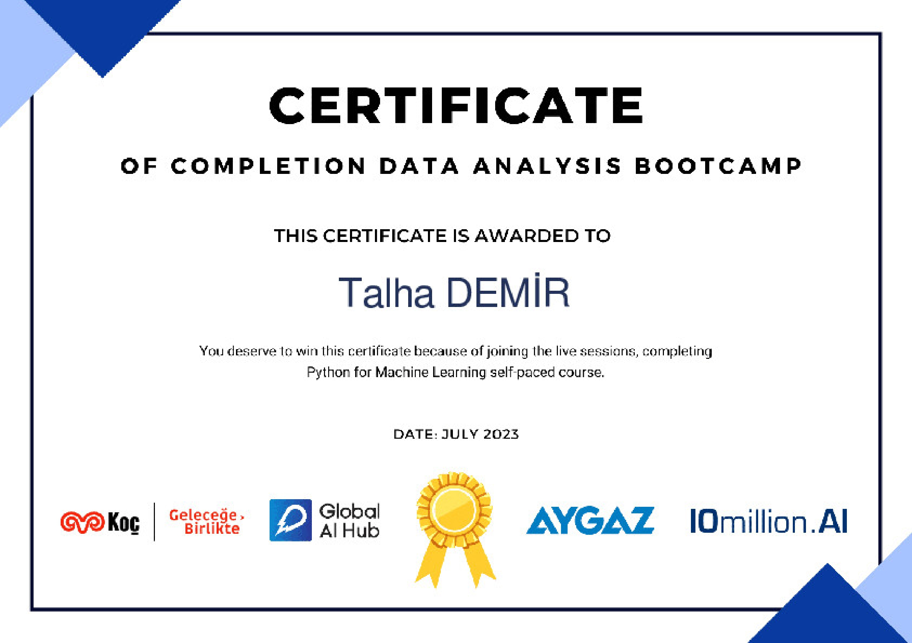
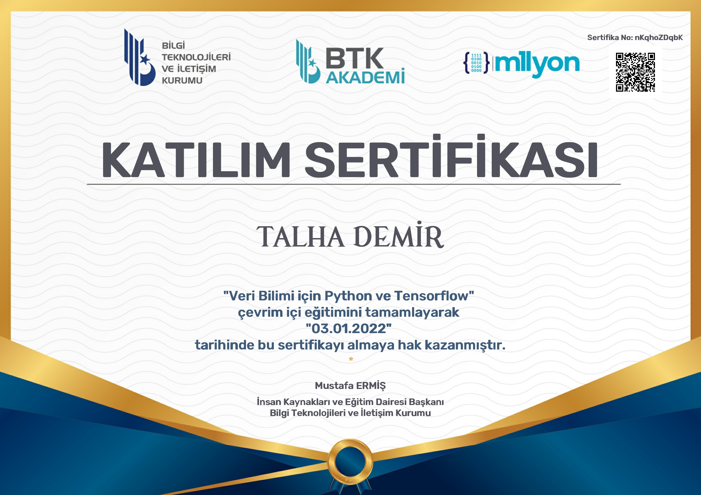

# Talha Demir

Hello there! I'm Talha Demir, a 4th-year Mechatronics Engineering student at Nişantaşı University. Additionally, I am pursuing a degree in Software Engineering at Ecole 42 Istanbul, with a keen interest in the field of Data Science.

## Education

- **Nişantaşı University**
  - *Degree:* Mechatronics Engineering
  - *Year:* 4th

- **Ecole 42 Istanbul**
  - *Program:* Software Engineering

### About Mechatronics Engineering
I have a passion for Mechatronics Engineering, where I integrate mechanical and electrical systems with software to create intelligent products and processes. This multidisciplinary field fascinates me with its potential to solve complex problems through a combination of various engineering disciplines.

### About Ecole 42 Istanbul
Studying Software Engineering at Ecole 42 Istanbul has provided me with a unique learning experience. The project-based curriculum and peer-to-peer evaluation system have honed my programming skills and fostered a collaborative learning environment.

### Data Science Interest
In addition to my core engineering studies, I have a deep interest in Data Science. I find the exploration and extraction of valuable insights from data to be a fascinating and impactful aspect of modern technology. I am eager to apply my analytical skills to real-world problems and contribute to the evolving field of Data Science.

## Work Experience

### ArVis Teknoloji - Artificial Intelligence Research and Development Intern
During my internship at ArVis Teknoloji, I served as an Artificial Intelligence Research and Development Intern. In this role, I attended presentations from esteemed professors at various universities, participated in training sessions on AI models, and collaborated with my team to develop our own project.

### Alpplas Industrial Investments Inc. - TÜBİTAK 2209-B Intern
At Alpplas Industrial Investments Inc., I completed an internship focused on TÜBİTAK 2209-B university-industry collaboration. Here, I was involved in writing software for an industrial-type machine and worked extensively on microprocessors.

## Projects

### Teknofest 2022-2023 - Agricultural Unmanned Ground Vehicle
- Led a team in the Teknofest 2022-2023 Agricultural Unmanned Ground Vehicle competition, reaching the finals among 185 teams.
- Focused on ROS for mapping and image processing.
- Achieved a top 15 finalist position, showcasing dedication to robotics and autonomous systems.

### Ecole 42 - Minishell Project
- **Description:**
  - Undertook the Minishell project at Ecole 42, recreating a Bash shell in the C programming language.
  - Enhanced understanding of system programming and delved into the intricacies of shell design.
  - Successfully implemented core functionalities, handling commands, and managing processes.

### Ecole 42 - IRC Project
- Developed an IRC (Internet Relay Chat) project as part of my coursework at Ecole 42.
- This project involved creating an IRC server example that manages channels and users in a messaging program.
- Implemented in C++ with an object-oriented approach.

## Certificates

### Machine Learning Summer Camp - MIUUL Platform

- Completed the MIUUL Platform's Machine Learning Summer Camp, receiving training from Vahit Keskin on feature engineering, machine learning, and SQL. Successfully completed assignments and projects during the camp.

### Data Analysis Bootcamp - Aygaz Global AI Hub

- Participated in the Aygaz Global AI Hub Data Analysis Bootcamp, collaborating with instructors from Global AI Hub and Aygaz on various training sessions and projects. Gained hands-on experience in data analysis and learned best practices in the field.

### Python with TensorFlow - BTK Akademi

- Successfully completed the Python with TensorFlow course on BTK Akademi, gaining proficiency in building and training machine learning models using TensorFlow and Python.

## Skills

### Python
- Proficient in Python for data analysis, machine learning, and general-purpose programming.

### C++
- Strong skills in C++ with a focus on object-oriented programming.

### C
- Proficient in C programming, demonstrated through various projects.

### SQL
- Experience with SQL for database management and querying.

### Git
- Proficient in using Git for version control and collaborative software development.

### Linux
- Comfortable working with Linux environments and command-line interfaces.
